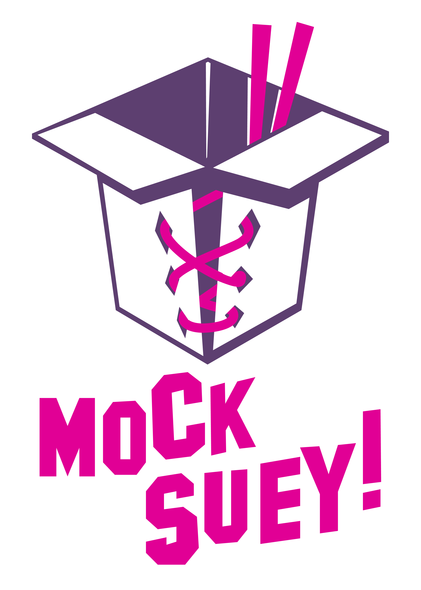

[](https://rubygems.org/gems/mock-suey) [](https://github.com/test-prof/mock-suey/actions)

# Mock Suey



A collection of tools to keep mocks in line with real objects.

> Based on the RubyConf 2022 talk ["Weaving and seaming mocks"][the-talk]

## Table of contents

- [Installation](#installation)
- [Typed doubles](#typed-doubles)
  - [Using with RBS](#using-with-rbs)
  - [Using with Sorbet](#using-with-sorbet)
  - [Typed doubles limitations](#typed-doubles-limitations)
- [Mock context](#mock-context)
- [Auto-generated type signatures and post-run checks](#auto-generated-type-signatures-and-post-run-checks)
- [Mock contracts verification](#mock-contracts-verification)
- [Tracking stubbed method calls](#tracking-stubbed-method-calls)
- [Tracking real method calls](#tracking-real-method-calls)
- [Configuration](#configuration)
- [Future development](#future-development)

## Installation

```ruby
# Gemfile
group :test do
  gem "mock-suey"
end
```

Then, drop `"require 'mock-suey'` to your `spec_helper.rb` / `rails_helper.rb` / `whatever_helper.rb`.

## Typed doubles

MockSuey enhances verified doubles by adding type-checking support: every mocked method call is checked against the corresponding method signature (if present), and an exception is raised if types mismatch.

Consider an example:

```ruby
let(:array_double) { instance_double("Array") }

specify "#take" do
  allow(array_double).to receve(:take).and_return([1, 2, 3])

  expect(array_double.take("three")).to eq([1, 2, 3])
end
```

This test passes with plain RSpec, because from the verified double perspective everything is valid. However, calling `[].take("string")` raises a TypeError in runtime.

With MockSuey and [RBS][rbs], we can make verified doubles stricter and ensure that the types we use in method stubs are correct.

To enable typed verified doubles, you must explicitly configure a type checker.

### Using with RBS

**NOTE:** RBS 3.0+ is not supported yet. We're working on it.

To use MockSuey with RBS, configure it as follows:

```ruby
MockSuey.configure do |config|
  config.type_check = :ruby
  # Optional: specify signature directries to use ("sig" is used by default)
  # config.signature_load_dirs = ["sig"]
  # Optional: specify whether to raise an exception if no signature found
  # config.raise_on_missing_types = false
end
```

Make sure that `rbs` gem is present in the bundle (MockSuey doesn't require it as a runtime dependency).

That's it! Now all mocked methods are type-checked.

### Typed doubles limitations

Typed doubles rely on the type signatures being defined. What if you don't have types (or don't want to add them)? There are two options:

1) Adding type signatures only for the objects being mocked. You don't even need to type check your code or cover it with types. Instead, you can rely on runtime checks made in tests for real objects and use typed doubles for mocked objects.

2) Auto-generating types on-the-fly from the real call traces (see below).

### Using with Sorbet

To use Mock Suey with Sorbet, configure it as follows:

```ruby
MockSuey.configure do |config|
  config.type_check = :sorbet
end
```

Make sure that `sorbet` and `sorbet-runtime` gem are present in the bundle according to the [sorbet instruction](https://sorbet.org/docs/adopting#step-1-install-dependencies).
That's it! Now all mocked methods are type-checked.

### raise_on_missing_types

If a signature is described in a `.rb` file, it will be used by `sorbet-runtime` and type checking will be available.
One of the gems that is using sorbet signatures is [ShopifyAPI](https://github.com/Shopify/shopify-api-ruby/blob/main/lib/shopify_api/auth.rb) for example.

However, many signatures are declared inside `.rbi` files, like 1) signatures for [stdlib and core types](https://github.com/sorbet/sorbet/tree/master/rbi/core) and 2) signatures for most libraries including [rails](https://github.com/chanzuckerberg/sorbet-rails/blob/master/sorbet/rbi/sorbet-typed/lib/activerecord/all/activerecord.rbi).
Unfortunately, these types cannot be loaded into runtime at the moment.
It's not possible to type check their mocks yet.

Checking types defined in .rbi files is only available through `rbs typecheck` command which uses [custom ruby binary](https://github.com/sorbet/sorbet/blob/master/docs/running-compiled-code.md).

You should consider changing `raise_on_missing_types` to `false` if you use Sorbet.

```ruby
MockSuey.configure do |config|
  config.type_check = :sorbet
  config.raise_on_missing_types = false
end
```

## Mock context

Mock context is a re-usable mocking/stubbing configuration. Keeping a _library of mocks_
helps to keep fake objects under control. The idea is similar to data fixtures (and heavily inspired by the [fixturama][] gem).

Technically, mock contexts are _shared contexts_ (in RSpec sense) that _know_ which objects and methods are being mocked at the boot time, not at the run time. We use this knowledge to collect calls made on _real_ objects (so we can use them for the mocked calls verification later).

### Defining and including mock contexts

The API is similar to shared contexts:

```ruby
# Define a context
RSpec.mock_context "Anyway::Env" do
  let(:testo_env) do
    {
      "a" => "x",
      "data" => {
        "key" => "value"
      }
    }
  end

  before do
    env_double = instance_double("Anyway::Env")
    allow(::Anyway::Env).to receive(:new).and_return(env_double)

    allow(env_double).to receive(:fetch).with("UNKNOWN", any_args).and_return(Anyway::Env::Parsed.new({}, nil))
    allow(env_double).to receive(:fetch).with("TESTO", any_args).and_return(Anyway::Env::Parsed.new(testo_env, nil))
    allow(env_double).to receive(:fetch).with("", any_args).and_return(nil)
  end
end

# Include in a test file
describe Anyway::Loaders::Env do
  include_mock_context "Anyway::Env"

  # ...
end
```

It's recommended to keep mock contexts under `spec/mocks` or `spec/fixtures/mocks` and load them in the RSpec configuration file:

```ruby
Dir["#{__dir__}/mocks/**/*.rb"].sort.each { |f| require f }
```

### Accessing mocked objects information

You can get the registry of mocked objects and methods after all tests were loaded,
for example, in the `before(:suite)` hook:

```ruby
RSpec.configure do |config|
  config.before(:suite) do
    MockSuey::RSpec::MockContext.registry.each do |klass, methods|
      methods.each do |method_name, stub_calls|
        # Stub calls is a method call object,
        # containing the information about the stubbed call:
        # - receiver_class == klass
        # - method_name == method_name
        # - arguments: expected arguments (empty if expects no arguments)
        # - return_value: stubbed return value
      end
    end
  end
end
```

## Auto-generated type signatures and post-run checks

We can combine typed doubles and mock contexts to provide type-checking capabilities to codebase not using type signatures. For that, we can generate type signatures automatically by tracing _real_ object calls.

You must opt-in to use this feature:

```ruby
MockSuey.configure do |config|
  # Make sure type checker is configured
  config.type_check = :ruby
  config.auto_type_check = true
  # Choose the real objects tracing method
  config.trace_real_calls_via = :prepend # or :trace_point
  # Whether to raise if type is missing in a post-check
  # (i.e., hasn't been generated)
  config.raise_on_missing_auto_types = true
end
```

Under the hood, we use the [Tracking real method calls](#tracking-real-method-calls) feature described below.

**IMPORTANT**: Only objects declared within mock contexts could be type-checked.

### Limitations

Currently, this feature only works if both real objects and mock objects calls are made during the same test run. Thus, tests could fail when running tests in parallel.

## Mock contracts verification

Types drastically increase mocks/stubs stability (or consistency), but even they do not guarantee that mocks behave the same way as real objects. For example, if your method returns completely different results depending on the values (not types) of the input.

The only way to provide ~100% confidence to mocks is enforcing a contract. One way to enforce mock contracts is to require having a unit/functional tests where a real object receives the same input and returns the same result as the mock. For example, consider the following tests:

```ruby
describe Accountant do
  let(:calculator) { instance_double("TaxCalculator") }

  # Declaring a mock == declaring a contract (input/output correspondance)
  before do
    allow(calculator).to receive(:tax_for_income).with(2020).and_return(202)
    allow(calculator).to receive(:tax_for_income).with(0).and_return(0)
  end

  subject { described_class.new(calculator) }

  specify "#after_taxes" do
    # Assuming the #after_taxes method calls calculator.tax_for_income
    expect(subject.after_taxes(2020)).to eq(1818)
    expect(subject.after_taxes(0)).to be_nil
  end
end

describe TaxCalculator do
  subject { described_class.new }

  # Adding a unit-test using the same input
  # verifies the contract
  specify "#tax_for_income" do
    expect(subject.tax_for_income(2020)).to eq(202)
    expect(subject.tax_for_income(0)).to eq(0)
  end
end
```

We need a way to enforce mock contract verification. In other words, if the dependency behaviour changes and the corresponding unit-test reflects this change, our mock should be marked as invalid and result into a test suit failure.

One way to do this is to introduce explicit contract verification (via custom mocking mechanisms or DSL or whatever, see [bogus][] or [compact][], for example).

Mock Suey chooses another way: automatically infer mock contracts (via mock contexts) and verify them by collecting real object calls during the test run. You can enable this feature via the following configuration options:

```ruby
MockSuey.configure do |config|
  config.verify_mock_contracts = true
  # Choose the real objects tracing method
  config.trace_real_calls_via = :prepend # or :trace_point
end
```

Each method stub represents a contract. For example:

```ruby
allow(calculator).to receive(:tax_for_income).with(2020).and_return(202)
allow(calculator).to receive(:tax_for_income).with(0).and_return(0)

#=> TaxCalculator#tax_for_income: (2020) -> Integer
#=> TaxCalculator#tax_for_income: (0) -> Integer
```

If the method behaviours changes, running tests would result in a failure if mock doesn't reflect the change:

```ruby
# Assuming we decided to return nil for non-positive integers
specify "#tax_for_income" do
  expect(subject.tax_for_income(0)).to be_nil
end
```

The test suite will fail with the following exception:

```sh
$ rspec accountant_spec.rb

........

1) Mock contract verification failed:
   No matching call found for:
     TaxCalculator#tax_for_income: (0) -> Integer
   Captured calls:
     (0) -> NilClass
```

The contract describes which explicit input values result in a particular output type (not value). Such verification can help to verify boundary conditions (e.g., when some inputs result in nil results or exceptions).

### Limitations

1. Currently, verification takes into account only primitive values (String, Number, Booleans, plain Ruby hashes and arrays, etc.). Custom classes are not yet supported.

2. Similarly to auto-type checks, this feature does not yet support parallel tests execution.

## Tracking stubbed method calls

The core functionality of this gem is the ability to hook into mocked method invocations to perform custom checks.

**NOTE:** Currently, only RSpec is supported.

You can add an after mock call callback as follows:

```ruby
MockSuey.on_mocked_call do |call_obj|
  # Do whatever you want with the method call object,
  # containing the following fields:
  # - receiver_class
  # - method_name
  # - arguments
  # - return_value
end
```

By default, MockSuey doesn't keep mocked calls, but if you want to analyze them
at the end of the test suite run, you can configure MockSuey to keep all the calls and
access them later:

```ruby
MockSuey.configure do |config|
  config.store_mocked_calls = true
end

# Them, you can access them in the after(:suite) hook, for example
RSpec.configure do |config|
  config.after(:suite) do
    p MockSuey.stored_mocked_calls
  end
end
```

## Tracking real method calls

This gem provides a method call tracking functionality for non-double objects.
You can use it separately (not as a part of auto-type-checking or contract verification features). For example:

```ruby
RSpec.configure do |config|
  tracer = MockSuey::Tracer.new(via: :trace_point) # or via: :prepend

  config.before(:suite) do
    tracer.collect(SomeClass, %i[some_method another_method])
    tracer.start!
  end

  config.after(:suite) do
    calls = traces.stop
    # where call is a call object
    # similar to a mocked call object described above
  end
end
```

## Configuration

Additional configuration options could be set:

```ruby
MockSuey.configure do |config|
  # A logger instance
  config.logger = Logger.new($stdout)
  # You can also specify log level and whether to colorize logs
  # config.log_level = :info
  # config.color = ? # Depends on the logging device
  # Debug mode is a shortcut to setup an STDOUT logger with the debug level
  config.debug = ENV["MOCK_SUEY_DEBUG"] == "true" # or 1, y, yes, or t
end
```

## Future development

I'm interested in the following contributions/discussions:

- Figure out parallel builds
- Sorbet support
- Minitest support
- Advanced mock contracts (custom rules, custom classes support, etc.)
- Methods delegation (e.g., `.perform_async -> #perform`, `.call -> #call`)
- Exceptions support in contracts verification

## Contributing

Bug reports and pull requests are welcome on GitHub at [https://github.com/test-prof/mock-suey](https://github.com/palkan/mock-suey).

## Credits

This gem is generated via [new-gem-generator](https://github.com/palkan/new-gem-generator).

## License

The gem is available as open source under the terms of the [MIT License](http://opensource.org/licenses/MIT).

[the-talk]: https://evilmartians.com/events/weaving-and-seaming-mocks
[rbs]: https://github.com/ruby/rbs
[sorbet]: https://github.com/sorbet/sorbet
[fixturama]: https://github.com/nepalez/fixturama
[bogus]: https://github.com/psyho/bogus
[compact]: https://github.com/robwold/compact
